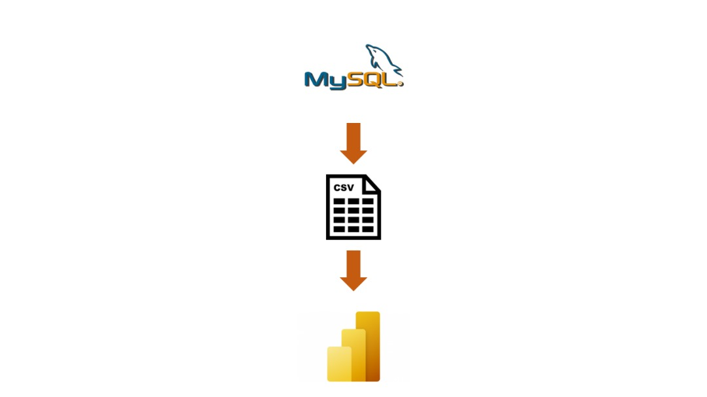
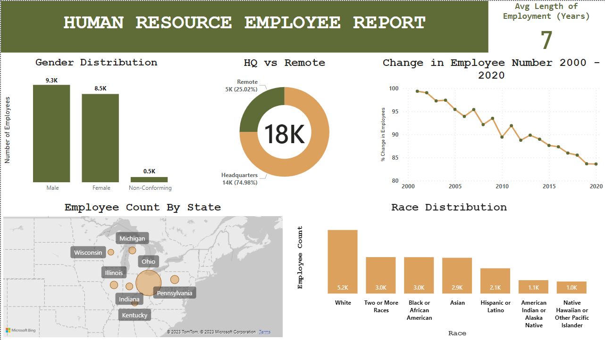

# HR Data Analytics Project

## Overview

This repository contains a data analytics project focused on human resources (HR) data. The dataset comprises 22,214 rows and 13 columns, with information about employees, including their ID, age, name, hire date, department, and termination date if applicable. The data was originally in a CSV file but has been loaded into a MySQL Relational Database Management System (RDBMS) for analysis.

## Project Objective

The primary objective of this project is to perform comprehensive data analysis on the HR dataset. The analysis aims to extract valuable insights and patterns related to employee information, such as turnover rates, departmental trends, and more. By leveraging data analytics techniques, we hope to provide actionable recommendations for HR decision-makers.

## Dataset

The dataset consists of the following columns:

1. **Employee ID**: A unique identifier for each employee.
2. **Age**: The age of each employee.
3. **Name**: The name of the employee.
4. **Hire Date**: The date when the employee was hired.
5. **Department**: The department to which the employee belongs.
6. **Termination Date**: If applicable, the date when the employee left the company.

## Data Cleaning and Preprocessing

Before analysis, the dataset underwent a thorough cleaning and preprocessing phase to ensure data quality and consistency. The steps involved in data preparation include:

- Handling missing data.
- Correcting data types.
- Removing duplicates.
- Ensuring data consistency.
- Validating date formats.
- Handling outliers if necessary.

## Data Analysis

The core of this project revolves around data analysis. We explore various aspects of the HR data, including:

- **Employee Demographics**: Understanding the age distribution and other demographic characteristics of employees.
- **Turnover Analysis**: Analyzing turnover rates and identifying factors contributing to employee departures.
- **Departmental Insights**: Examining department-specific trends and performance.
- **Tenure Analysis**: Evaluating employee tenure and its impact on the organization.
- **Time Series Analysis**: Exploring patterns over time, including hiring and termination trends.

## Data Visualisation

You may make a variety of visualizations in Power BI, such as bar charts, line graphs, pie charts, and heat maps. Make the visualizations specific to the measurements and patterns you want to highlight.

## Tools Used

- **MySQL**: The dataset is stored in a MySQL RDBMS.
- **GitHub**: The project is hosted on GitHub to facilitate collaboration and sharing of results.
- **PowerBI**: The results of the analysis are visualised using PowerBI.

## Findings

**1. Gender Breakdown**: The company has more male employees, but there is a gender balance between male and female employees. However, a very small number of the company identify as gender non-conforming.

**2. Race/Ethnicity Diversity**: White employees make up the largest single racial group within the company. However, the company has a good distribution of employees who are not white. With the total number of POC (people of colour) employees being greater than the number of white employees.

**3. Age Distribution**: Most of the employees are between the ages 25 - 54. Less than 1.5k employees are above the age of 55 and less than 2k employees are between the ages 18 - 24.

**4. Location Distribution**: Nearly 75% of the employees work at the headquarters, versus remote locations.

**5. Average Tenure of Terminated Employees**: The average length of employment for employees who have been terminated is 7 years.

**6. Employee Distribution in Departments**: Most of the employees work within the engineering department. Accounting comes second. The least amount of employees work within the auditing department.

**7. Turnover Rate by Department**: The auditing department has the highest turnover rate of 0.15.

**8. Location of Employees**: Ohio has the highest number of employees, at 14,788. The remaining employees are distributed nearly evenly across Michigan, Pennsylvania, Illinois, Indiana, Kentucky, and Wisconsin.

**9. Employee Count Trend**: The rate of termination has increased while the rate of hire has gone down by a bit, but not much. 

## Conclusion

In conclusion, the HR analytics project revealed a relatively balanced gender distribution, a diverse racial/ethnic composition, and a predominant age group of employees between 25 and 54. The majority of employees work at the company's headquarters, and the average tenure of terminated employees is 7 years. Engineering and accounting departments have the highest employee counts, while the auditing department experiences the highest turnover rate. Ohio houses the largest workforce, and there's a concerning trend of increasing terminations with a slight decline in hiring.
